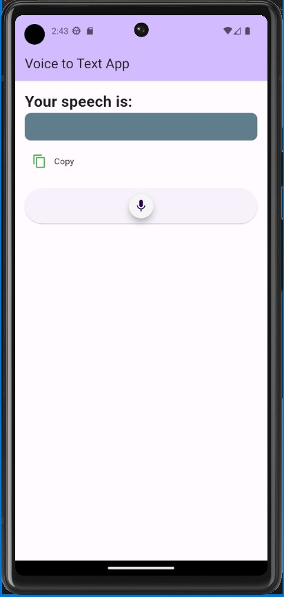

# Voice-to-Text App

A Flutter application designed to effortlessly convert spoken words into text. This app delivers a seamless experience with enhanced responsiveness, ensuring optimal performance across various screen sizes. Leveraging the `speech_to_text` package, users can easily record their speech, watch it transcribed in real-time, and copy the results to the clipboard.

## Features:
- Real-time speech-to-text conversion
- Dynamic microphone button with a glowing effect
- Copy transcribed text to the clipboard
- Responsive layout for diverse screen sizes

## Usage:
1. **Clone the repository:**
   ```bash
   git clone https://github.com/Basel-75/voice_to_text_app.git
   cd voice_to_text_app
Open the project in your preferred Flutter development environment (e.g., VS Code, Android Studio).

Run the app on an emulator or physical device.

Screenshots:


## Dependencies:
Flutter
speech_to_text
avatar_glow
## Author:
Basel-75
Feel free to contribute, report issues, or suggest enhancements!
